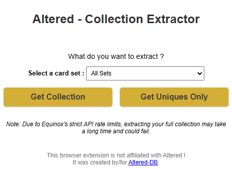
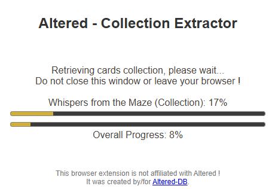
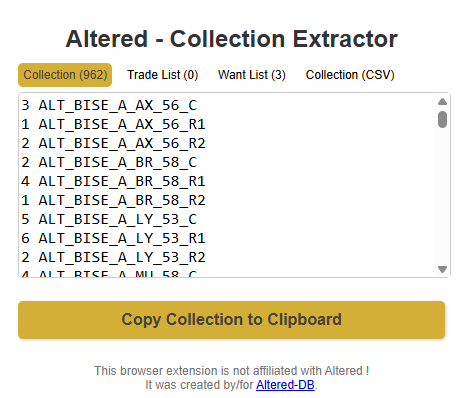

# Altered Collection Extractor

This browser extension lets you download your **card collection**, **want list**, and **trade list** from [Altered.gg](https://altered.gg) using the official API. The downloaded data is in the following format: `Quantity ID`.

You can also retrieve your collection in a **CSV format** (tab separated) with the following columns: card ID, card name, faction, rarity, set, type, and quantity. You can then paste it directly into an Excel sheet if needed.

**All operations are performed locally** and stay within your browser for security reasons.

## Export Options

- Cards Collection  
- Want List  
- Trade List  
- Collection CSV (Tab Separated)

## Screenshots

Here are some screenshots to illustrate the extension:

  
  
  

## Downloads

- **Chrome:** [Download from Chrome Web Store](https://chromewebstore.google.com/detail/altered-collection-extrac/oilacpbjlailfffkpmpklcgipomnfpom)  
- **Firefox:** [Download from Mozilla Add-ons](http://addons.mozilla.org/en-US/firefox/addon/altered-collection-extractor/)

## Security Notice

⚠️ This extension uses sensitive data. Do **not** use it if you do not trust the source.  
I disclaim all responsibility for any issues or misuse that may arise from using this extension.

This extension uses your **Bearer token** only in the browser. It is **never stored or sent anywhere**. **Never share it**, even if it is temporary, as it grants full access to your account.

## Source Code

You can review the source code of the current version here: [View Source](https://robwu.nl/crxviewer/?crx=https%3A%2F%2Fchromewebstore.google.com%2Fdetail%2Faltered-collection-extrac%2Foilacpbjlailfffkpmpklcgipomnfpom)